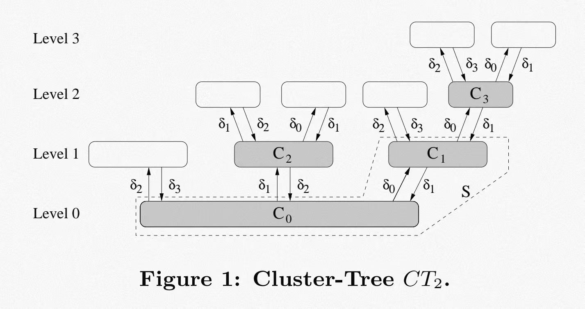

## 一.论文背景

在一个大型分布式系统中，如果每个计算节点只能通过有限轮通信获得自己附近的信息，
那么它是否还能完成一些原本需要全局信息才能完成的任务？
该论文就是回答这样的问题，它证明存在一些问题，即使节点之间可以快速通信，也无法仅靠局部信息在较少轮数内得到好的结果。
举一个简单例子理解，假设我们有A、B、C、D、E五个节点，以及(A,B)、(B,C)、(C,D)、(D,E)四条边，
现讨论最小顶点覆盖问题(Minimum Vertex Cover，MVC，要求选择尽可能少的节点，使得图中每条边至少有一个端点被选择)。
如果我们能够了解完整的图结构，那么解决这个问题是容易的，我们能够得知所有的顶点与边的信息，从而通过算法最后选择B和D。
那如果我们只知道局部信息呢？在这个例子中我们假设有限轮通信就是只有一轮通信，
即A知道有邻居B，B知道有邻居A和C，C知道有邻居B和D，D知道有邻居C和E，E知道有邻居D，
每个节点都要通过自己已有的信息以及局部性算法判断自己是否要被加入覆盖集中，
那么此时我们发现，B、C、D三个点看到的局部信息完全一样，都是拥有两个邻居，
那么任何确定性的局部算法都会让它们三个做出一样的决定，即如果B觉得自己要被选入覆盖集，C和D也同样会被选入，
但是了解全局信息的我们知道C这个点是不需要的，于是仅靠局部信息无法得到和已知全局一样好的结果。

前人工作简介

- 局部性计算的基础问题：Naor 和 Stockmeyer 提出了“什么可以被局部计算？”
- 分布式计算下界的开创性工作：Linial 提出了一个开创性的下界，证明了 Cole 和 Vishkin 提出的非均匀 $O(\log n)$ 染色算法在环形网络（ring）中是渐近最优的。
- 关于MVC和MDS的近似算法：Kuhn 和 Wattenhofer 给出了在 $k$ 轮通信中对最小顶点覆盖（MVC）和最小支配集（MDS）及其分数规划（LP）版本的近似率结果。此外，Feige 的工作证明了除非 $NP \subseteq DTIME(n^{O(\log \log n)})$，否则 MDS 无法获得优于 $\ln \Delta$ 的近似比。Gavril 和 Yannakakis 则提出了针对 MVC 问题的经典 2-近似算法。

## 二.核心思路

1. 目的是构建一个图，让两个节点经过k轮通信看到一模一样的局部图，则这两个节点无法决定自己是否应当加入到MVC，利用这个盲区使得最终无法得到最优解。

2. 论文的理论设定

> 使用“经典消息传递模型”：局部计算开销不计入，消息长度无限制，从而抽象掉了带宽拥塞、异步通信或算力不足等工程难题，确保论文推导的性能下界都是由于算法缺乏全局视野所导致的必然结果

3. 逻辑图的构建

   构造一个特殊的图 $G_k = (V, E)$。这个图里包含一个特殊的二分子图 $S$，它由两部分节点组成：

- 集合 $C_0$：包含 $n_0$ 个节点。每个节点在 $C_1$ 中有 $\delta_0$ 个邻居（度数为 $\delta_0$）。
- 集合 $C_1$：包含 $n_0 \cdot \frac{\delta_0}{\delta_1}$ 个节点。每个节点在 $C_0$ 中有 $\delta_1$ 个邻居（度数为 $\delta_1$），且满足 $\delta_1 > \delta_0$。

全局最优解（OPT）:
在全局视角下，我们要覆盖二分子图 S 的所有边：  
如果选 $C_1$ 中的节点放入顶点覆盖集，只需要 $n_0 \cdot \frac{\delta_0}{\delta_1}$ 个节点，就能把 S 的所有边全部覆盖。  
此时，$C_0$ 中完全不需要任何节点加入顶点覆盖。这是最省节点的全局最优方案。

树的逻辑结构如下：

(图中一个方框代表一堆节点的集合，即cluster，白色簇的作用为补齐度数)

最终达到的效果： 当递归树足够深（即K层），从C0和C1的节点向外各自探索k步，由于所有度数和邻居类型都被白色簇补齐，则两边延伸出去的局部探测树在拓扑结构上完全同构

4. 实体图的构建

直接构建逻辑结构是不现实的，因为树是递归定义无限大的，因此需要按需裁剪和映射，在有限的物理世界复用节点。
我们采取的做法是从Wenger图族D(r,q)里裁剪出一个子图，这个子图具有与逻辑图相同的局部结构，但规模较小。
为什么要用wenger？因为真实连边时如果一不小心连出环，局部算法在探测时会发现顺着环饶了回来，两边的视野不再是完美的树状，局部对称性被打破。
因此采用wenger撑大围长至2k+1，彻底消除小环，则任何节点探测k步，局部拓扑结构必定是一棵树。

- 如何从Wenger图族D(r,q)里裁剪出一个子图？

1. 基础映射：先拿出一个符合簇树规格的实例 $G'_k$。把 $G'_k$ 的节点用 $\mathbb{F}_q$ 里的元素进行唯一标记。
2. 过滤连边：

   "(p) 和 [l] 在 $G_k$ 中由一条边连接，当且仅当它们在 D(r,q) 中相连，并且节点 u 和 v 之间在 $G'_k$ 中存在一条边，使得 $c(u) = p_1$ 和 $c(v) = l_1$。"

   这句话的意思是,我们把大图 D(r,q) 作为模板，只有同时满足“代数方程约束”以及“簇树的宏观拓扑结构”的边才予以保留，其余不符合簇树规划的边全部删掉。

3. 剔除孤立点：最后，把没有关联边的孤立节点全部从图里扔掉。
